<h1 align="center"> Sistema de Parqueadero</h1>

  Sistema web desarrollado en Laravel para el registro y control de vehículos en un parqueadero.
  Estudiante: Kevin Cepeda
  Paralelo: 3
  Fecha: 18/12/2025

<h2> Descripción</h2>

Este sistema permite registrar el ingreso de vehículos reemplazando el registro manual en papel.
Se almacena la placa, tipo de vehículo, propietario (opcional), observaciones y la fecha/hora
de ingreso se registra automáticamente.

<h2> Funcionalidades</h2>
<ul>
  <li>Registro de vehículos</li>
  <li>Listado de vehículos activos</li>
  <li>Edición de información</li>
  <li>Marcado de salida del vehículo</li>
  <li>Interfaz usable en dispositivos móviles</li>
</ul>

<h2> Tecnologías</h2>
<ul>
  <li>Laravel</li>
  <li>PHP</li>
  <li>MySQL</li>
  <li>HTML5</li>
  <li>CSS</li>
  <li>Blade</li>
</ul>

<h2> Mi decisión de Diseño</h2>
<h3>1. Tabla</h3>

<strong>Nombre de la tabla:</strong> vehiculos

<table border="1" cellpadding="6">
  <tr>
    <th>Campo</th>
    <th>Tipo</th>
    <th>¿Obligatorio?</th>
  </tr>
  <tr>
    <td>id</td>
    <td>BIGINT (Auto incremental)</td>
    <td>Sí</td>
  </tr>
  <tr>
    <td>placa</td>
    <td>VARCHAR(10)</td>
    <td>Sí</td>
  </tr>
  <tr>
    <td>tipo</td>
    <td>VARCHAR(20)</td>
    <td>Sí</td>
  </tr>
  <tr>
    <td>propietario</td>
    <td>VARCHAR(100)</td>
    <td>No</td>
  </tr>
  <tr>
    <td>observaciones</td>
    <td>TEXT</td>
    <td>No</td>
  </tr>
  <tr>
    <td>created_at</td>
    <td>TIMESTAMP</td>
    <td>Sí</td>
  </tr>
  <tr>
    <td>updated_at</td>
    <td>TIMESTAMP</td>
    <td>Sí</td>
  </tr>
</table>

<h3>2. Tipos de vehículo</h3>

Los tipos de vehículo manejados en el sistema son:

<ul>
  <li>Carro</li>
  <li>Moto</li>
  <li>Camioneta</li>
</ul>

<h3>3. ¿Se puede eliminar registros?</h3>

<strong>Respuesta:</strong>  
No se eliminan físicamente los registros de la base de datos.  
Por decisión de diseño, los vehículos son marcados como <em>salidos</em> o eliminados de la vista principal,
permitiendo mantener un control y evitar la pérdida de información en caso de revisiones posteriores.

<h2> Interfaz del Sistema</h2>

<h3>Pantalla Principal y lista de los vehiculos ingresados</h3>
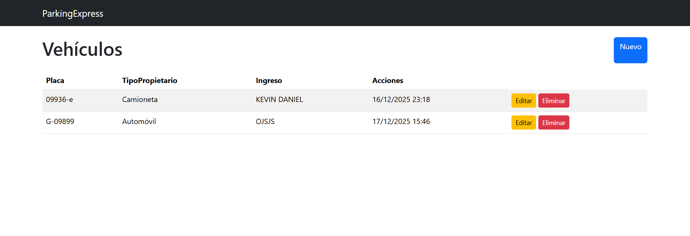

<h3>Formulario de Registro</h3>
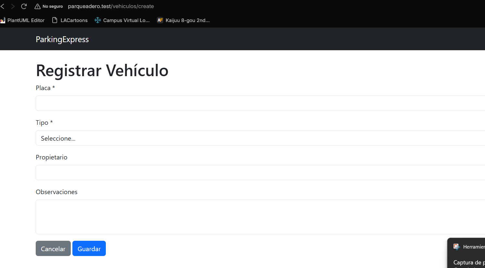

<h3>Editar el registro</h3>
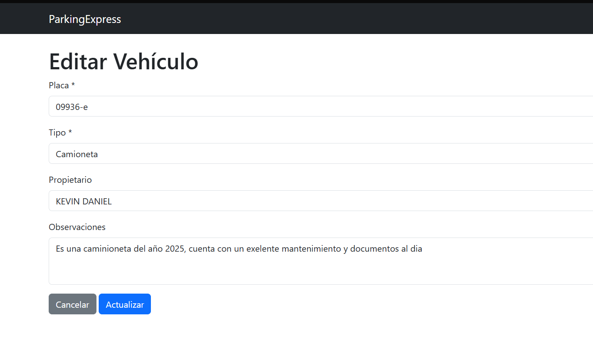

<h3>Mensaje emergente de eliminación </h3>

<h3>Pasos y como interactuo el modelo MVC en PHP</h3>

  Para el correcto funcionamiento del sistema es necesario tener
  <strong>Laravel Herd</strong> activo y en ejecución.  
  El proceso seguido fue el siguiente:

<ol style="font-family: Arial, Helvetica, sans-serif; font-size: 15px;">
  <li>Crear un nuevo proyecto Laravel utilizando Laravel Herd.</li>
  <li>Abrir el proyecto en el entorno de desarrollo <strong>PhpStorm</strong>.</li>
  <li>Configurar el archivo .env para la conexión a la base de datos MySQL.</li>
  <li>Verificar la conexión ejecutando las migraciones correspondientes.</li>
</ol>
<h3>Laravel corriendo y funcionando</h3>
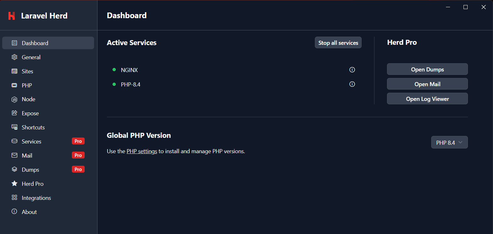
<h3> Evidencia del archivo .env para la conexion con MySQL</h3></h3>
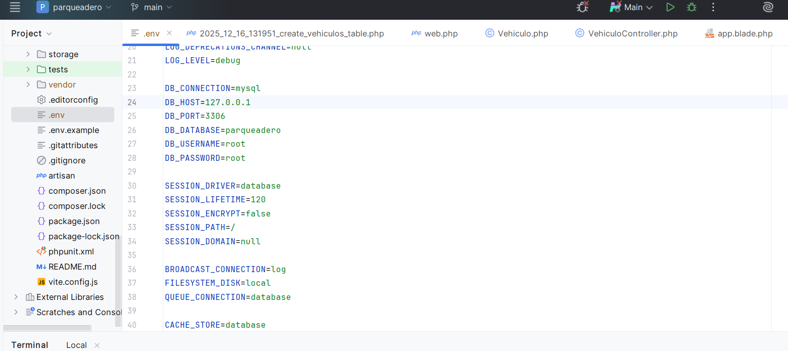
<h3>Con esto aseguramos la conexion de php con MySQL</h3>
<h3>Por linea de comando debemos crear la base de datos "parqueadero"</h3>
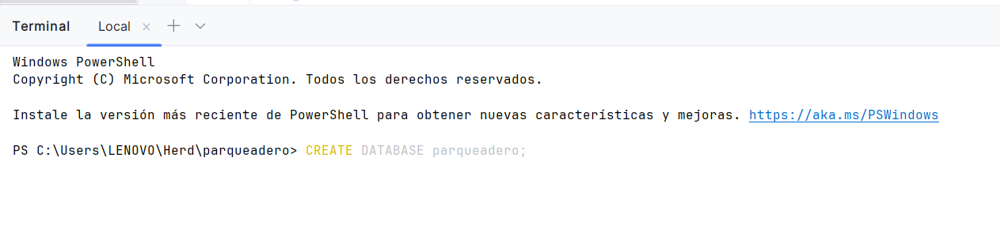

  Posteriormente para la creación de la migración, el modelo y el controlador se utilizó un solo comando
  proporcionado por Laravel:

<pre style="font-family: Consolas">
php artisan make:model Vehiculo -mcr
</pre>

  Este comando generó automáticamente los siguientes archivos:

<ul style="font-family: Arial, Helvetica, sans-serif; font-size: 15px;">
  <li>database/migrations/xxxx_create_vehiculos_table.php</li>
  <li>app/Models/Vehiculo.php</li>
  <li>app/Http/Controllers/VehiculoController.php</li>
  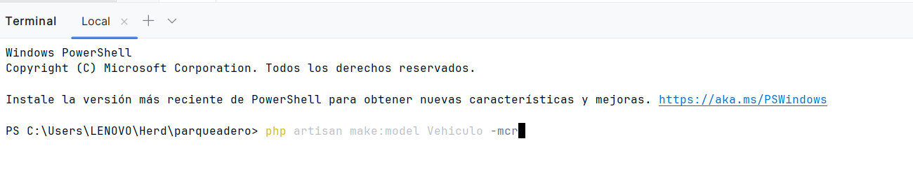   
</ul>

<h2> Contenido: /migrations/xxxx_create_vehiculos_table.php</h2>
 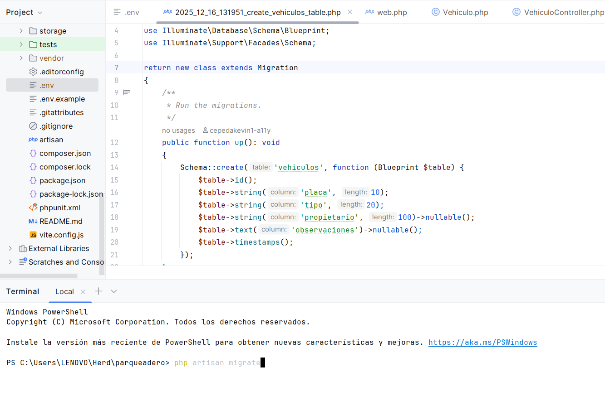 
 <h1> Este comando creará la tabla con las columnas ingresadas en la función up </h1>
 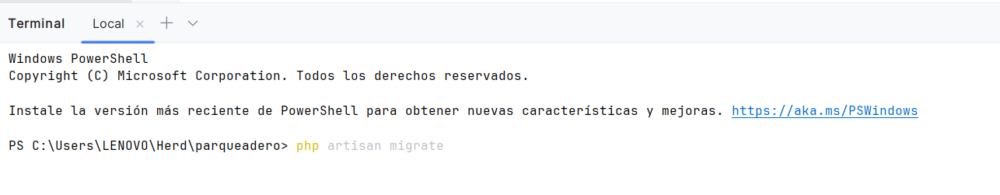 
 
 
<h2> Configuracion del Modelo: app/Models/Vehiculo.php:</h2>
 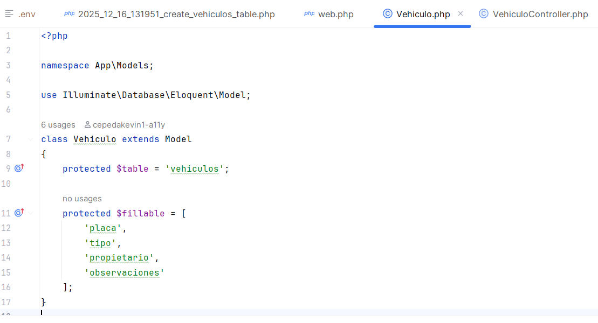  
<h2> Rutas: routes/web.php</h2>
 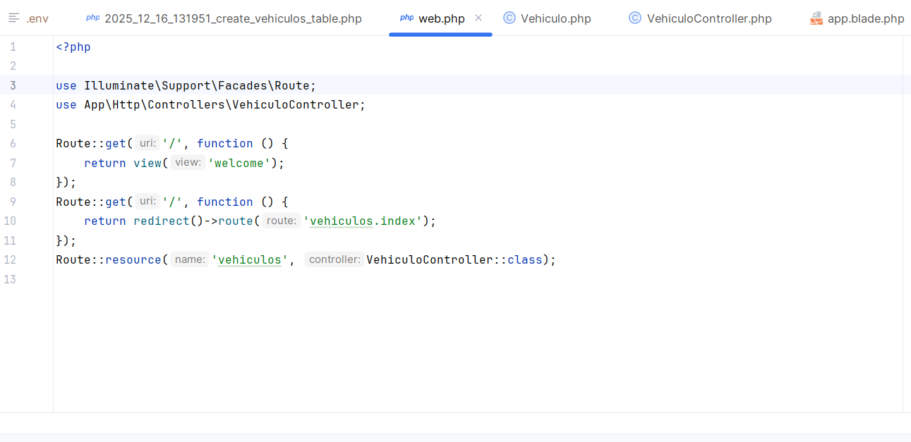  

<h2> Layouts, Controller y views</h2>

  Para la organización de las vistas del sistema se creó un layout base,
  definiendo las carpetas necesarias para la estructura del proyecto:

<pre style="font-family: Consolas, monospace; font-size: 14px; background-color: #f4f4f4; padding: 10px;">
mkdir -p resources/views/layouts
mkdir -p resources/views/vehiculos
</pre>

  Estas carpetas permiten separar el diseño general del sistema y las vistas
  específicas para la gestión de vehículos.

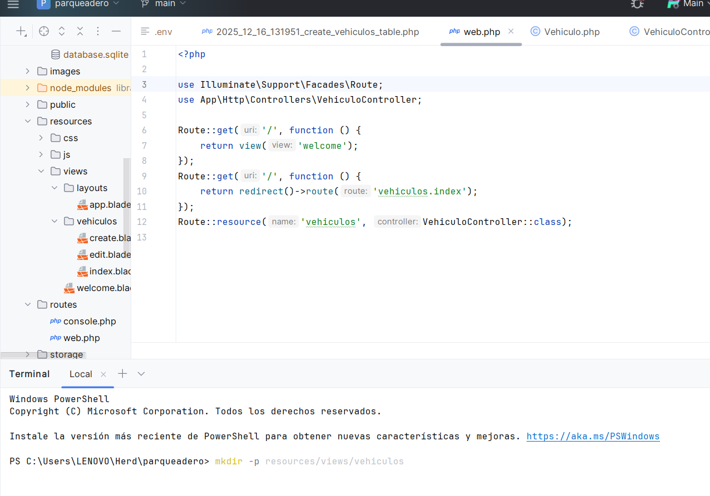  

  <h2>Controlador: VehiculoController</h2>
  <ul>
    <li><strong>index()</strong>: lista todos los vehículos y los envía a la vista <em>vehiculos.index</em>.</li>
    <li><strong>create()</strong>: muestra el formulario para crear un nuevo vehículo.</li>
    <li><strong>store()</strong>: valida datos, crea un vehículo y redirige con mensaje de éxito.</li>
    <li><strong>edit()</strong>: muestra el formulario de edición de un vehículo específico.</li>
    <li><strong>update()</strong>: valida datos, actualiza el vehículo y redirige con mensaje de éxito.</li>
    <li><strong>destroy()</strong>: elimina el vehículo y redirige con mensaje de éxito.</li>
  </ul>
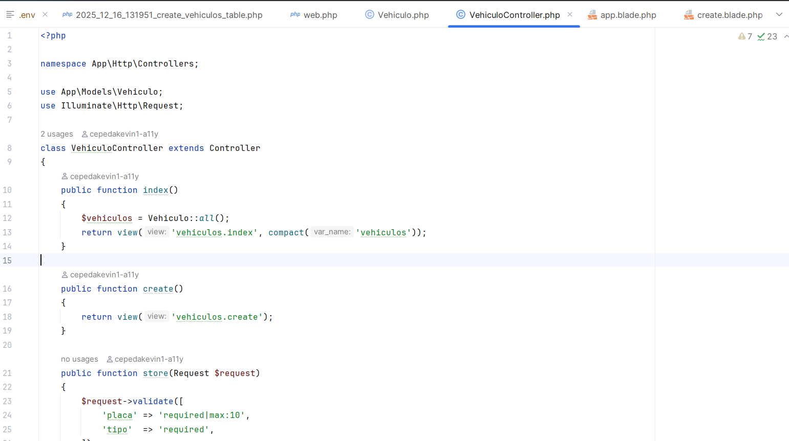  
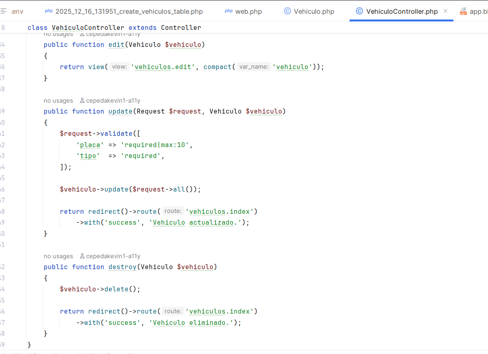 

<h2> Base de Datos</h2>

La aplicación utiliza MySQL. La tabla principal es <strong>vehiculos</strong>, creada mediante
migraciones de Laravel.

<h2> Ejecución</h2>
<pre>
git clone https://github.com/cepedakevin1-a11y/parqueadero-laravel.git
composer install
php artisan migrate
php artisan serve
</pre>
<h2> Repositorio</h2>

<a href="https://github.com/cepedakevin1-a11y/parqueadero-laravel">
Repositorio en GitHub
</a>

